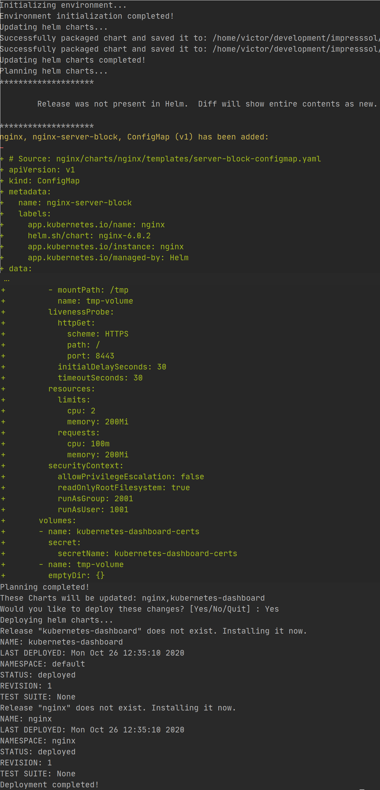
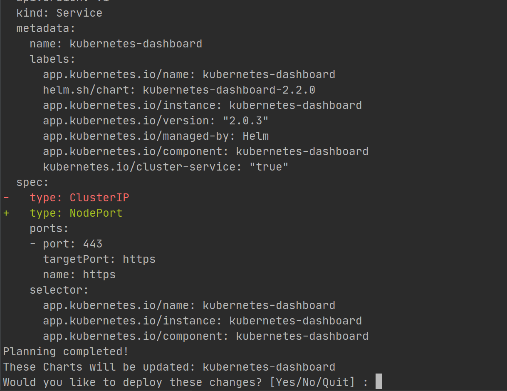

# Helm Charts Manager #

A command line tool to lint, plan and deploy multiple helm charts easily.

[](hhttps://github.com/iits-consulting/helm-charts-manager/blob/main/LICENSE)


[]()

### Prerequisites ###

* A Kubernetes cluster
* [Helm3 (>=V3.2.4)](https://helm.sh/docs/intro/install/)
* [Helm Diff Plugin](https://github.com/databus23/helm-diff)

### Features ###

* Helm chart linting.
* Helm chart planning and comparison with existing deployment.
* Helm chart deployment.
* YAML based configuration and environment definition.
* Automated updating and re-packaging existing charts
* Parallelized structure for optimized performance.

### Usage ###
* `helm-charts-manager lint [options]` : Run helm charts manager in linting mode to check charts for errors and bad practices.
* `helm-charts-manager plan [options]` : Run helm charts manager in planning mode to see the difference between existing deployment and current charts.
* `helm-charts-manager apply [options]` : Run helm charts manager in deployment mode to deploy the charts. Apply always plans first and has to be approved before deploying. This behaviour can be overriden with `--auto-approve` option.

### Command line options ###

* `-h | --help` : Shows the help screen.
* `-v | --version` : Shows version string.
* `--config-file <configFile>` : Path to the configuration YAML file for helm-charts-manager. Defaults to `./helm-charts-manager-config.yaml`
* `--charts-path <chartsPath>` : Path to the base directory where helm charts are stored. Defaults to `./`
* `--charts <charts>` : List of chart names separated with a comma to select the charts to be lined/planned/deployed. Defaults to the list of chart names in the configuration YAML.
* `--auto-approve` : Overrides the deployment y/n query. Useful for automated deployment via CI/CD pipelies.
* `--update` : Update and repackage the charts before linting/planning/deploying.
* `--debug` : Enable debug printouts for every command executed.

### Configuration via YAML ###
Please see `/test/test-config-apply.yaml`

**Important:** `STAGE` and `RELEASE_VERSION` environment variables are mandatory.

It is possible to specify multiple stages in the same configuration file. `STAGE` environment variable serves as a selector between different stages.

In the example file `RELEASE_VERSION` variable is created by concatenating `GIT_VERSION` and `GIT_LATEST_TAG` environment variables and therefore the ordering of commands is also important.

### Example: ###

First download and install minikube.

After that download all files from the example Folder and execute the following commands

```console
cd example
helm repo add bitnami https://charts.bitnami.com/bitnami
helm-charts-manager apply --update
```
You should see this output:



Now nginx and kubernetes-dashboard should be installed.

If we want to override some values we need to configure the helm-charts-manager-config.yaml file.

Open helm-charts-manager-config.yaml and add in line 22 at the end "--set kubernetes-dashboard.service.type=NodePort".

Now apply the changes with this command:

```console
helm-charts-manager apply --charts kubernetes-dashboard
```

You should see this output



As you can see he just updated kubernetes-dashboard

## Related projects

- [helmfile](https://github.com/roboll/helmfile) helm-charts-manager is the KISS version of helmfile. 
